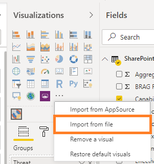

# cop-capability-sunburst

# Installation

Power BI Tools (SDK):
https://github.com/Microsoft/PowerBI-visuals-tools

**HOW TO DEBUG**
1. `cmd>"C:\Program Files (x86)\Google\Chrome\Application\chrome.exe" --remote-debugging-port=9222`
2. VSCode must have 'Debugger for Chrome' extension installed (Ctrl+X, Ctrl+Y)
3. VSCode > Terminal > `pbiviz start`
4. In Chrome opened in step 1, sign in to Power BI (PBI) Online and open the report with an instance of the Developer Visual (development mode should be enabled in PBI Online).
5. VSCode > Debug
6. Finally, breakpoints don't work, so fallback to logging like described here:
https://community.powerbi.com/t5/Developer/How-to-Debug-while-developing-Custom-Visuals/td-p/187053

**HOW TO INSTALL PBIVIZ**
1. Download/Build the pbiviz file.
2. Open Power BI report using Power BI Desktop [version 2.79.5768.663 64-bit (March 2020) or later].
3. Import pbiviz.  

4. The visual can be added to the report through drag and drop or by selecting.
5. Populate the 'Groups' fields as follows:
    - Threat
    - Capability
    - Component  

6. Populate the 'Values' field using a 3 digit value (e.g. 111)  

7. Each digit represents a different colour e.g. 111 would indicate the following:
    - Threat > Black
    - Capability > Black
    - Component > Black  

The full list of colours can be found below. These colours are set by default however can be changed in the settings.

Digit Value | Colour | Hex Value
--- | --- | ---
1 | Black | `#5E5E5E`
2 | Red | `#E03531`
3 | Amber | `#F0BD27`
4 | Green | `#51B364`

